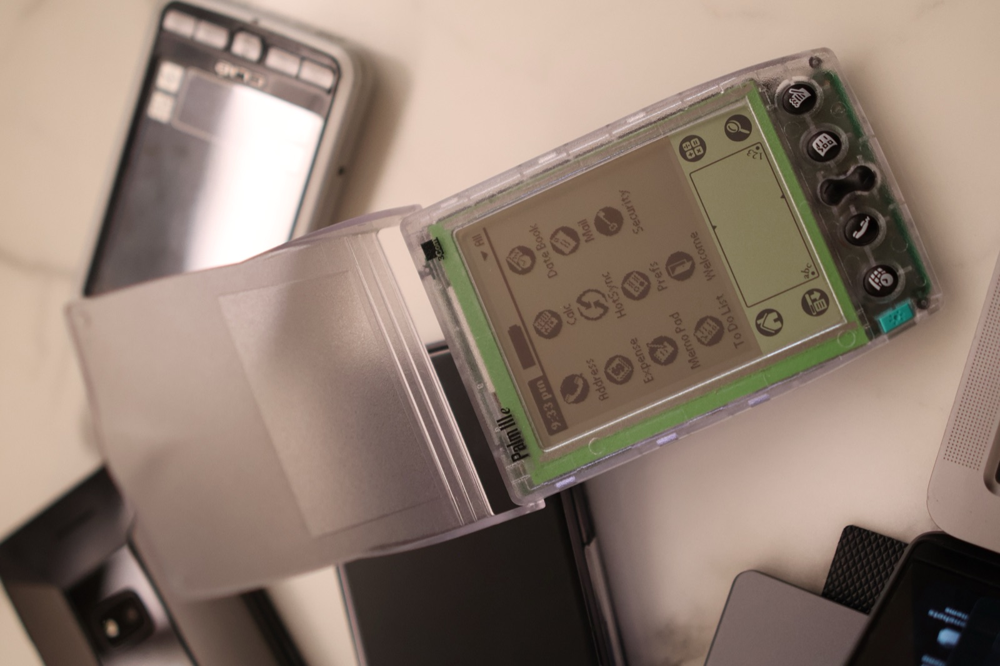
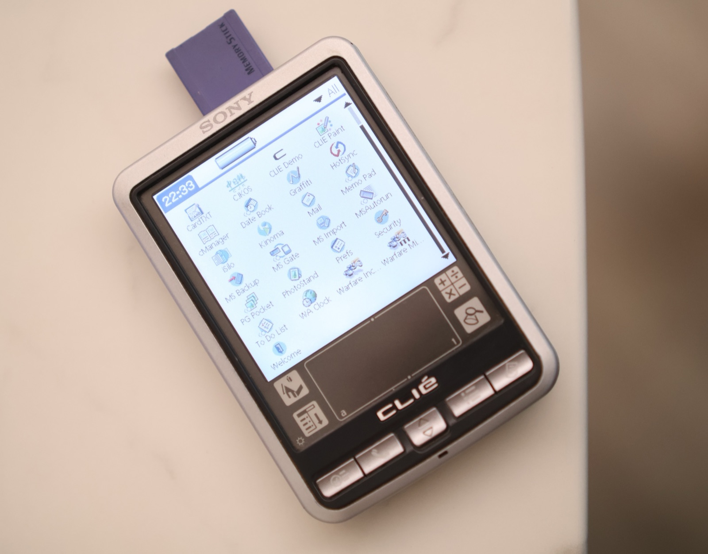
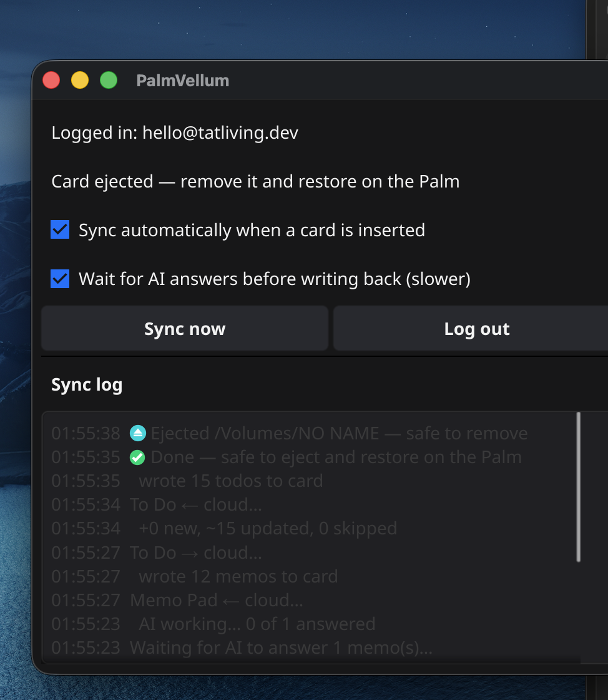
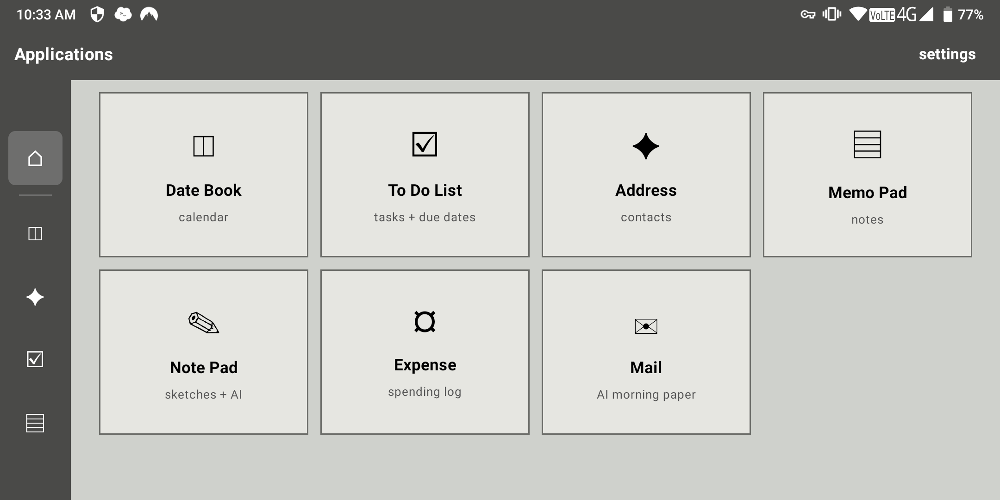
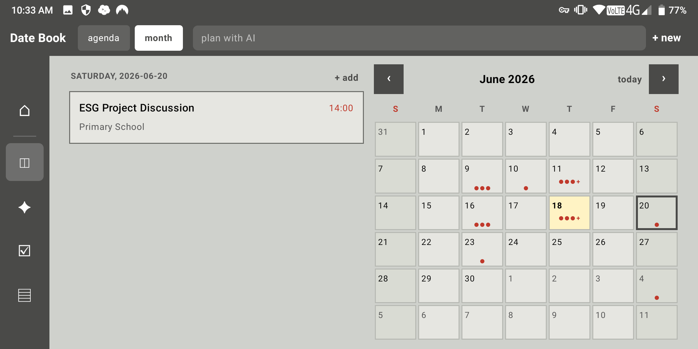
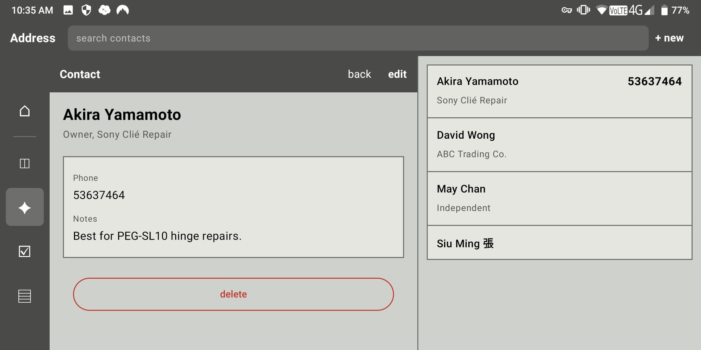
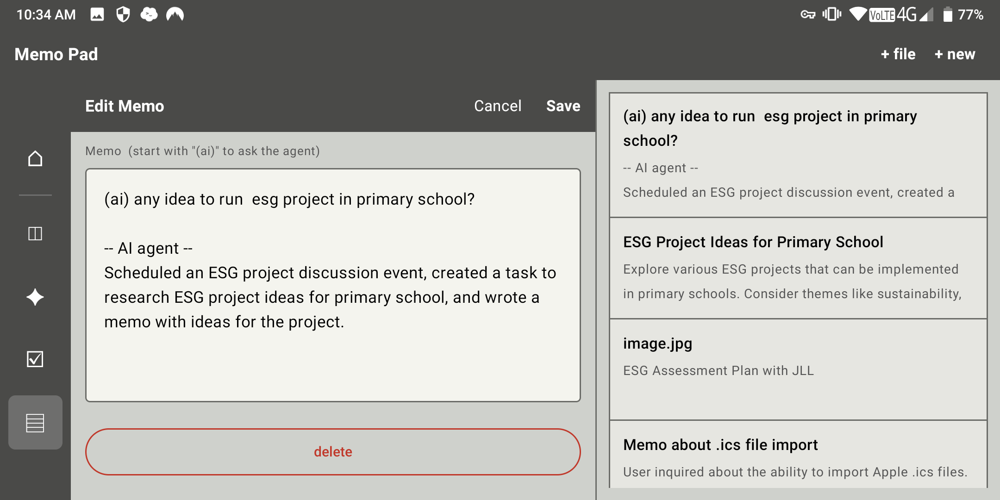

# PalmVellum

> *Some things deserve to be written down. Not all of them deserve to be online.*
> *有些事，還是想親手寫下來。* / *有些东西，值得写下来。有些事情，也不宜上线。*
>
> *A slow tool for a fast world.*

[繁體中文](#palmvellum-繁體中文) · [简体中文](#palmvellum-简体中文) · [日本語](#palmvellum-日本語) · [English](#english)

<table>
  <tr>
    <td width="50%"></td>
    <td width="50%"></td>
  </tr>
</table>

<sub>Reference hardware in hand: a 1999 Palm IIIe and a Sony Clié PEG-SL10 — the AAA-battery devices PalmVellum is built around. 繁中／简中：PalmVellum 圍繞嘅 AAA 電池機 — 1999 年 Palm IIIe 同 Sony Clié PEG-SL10。</sub>

<sub>Web: <a href="https://tatliving.dev/palmvellum/">tatliving.dev/palmvellum</a> · Organizers: <a href="https://tatliving.dev/palmvellum/app">tatliving.dev/palmvellum/app</a></sub>

---

## English

**PalmVellum is an open-source platform that brings cloud sync and AI assistance to native Palm Pilot applications from the years 1996 to 2003, while keeping the Palm experience fundamentally intact.**

You do not use a Palm because it can do more than a modern smartphone. You use it because it does just enough. Two AAA batteries. A monochrome screen. No constantly connected network. No camera. No infinite feed. No red badges waiting for you to respond. You pick it up, write something down, and put it back — and the thought stays there. It does not instantly become a notification. It does not need to be uploaded everywhere. It does not need to become urgent just because it exists. PalmVellum works in the background only when you ask it to. It can help organise natural language, recognise handwritten notes, summarise research, or create calendar events and tasks. Your Palm remains quiet. The platform begins working only when you invite it to.

| 2× AAA | 160×160 | 0 | 1996–2003 |
|---|---|---|---|
| power for months of ordinary life | enough space for what matters | no always-on wireless | the era that shaped our reference hardware |

### What does retro computing mean here?

It does not mean low-spec hardware. It does not mean treating the past as an aesthetic filter. For us, retro computing is a deliberate choice — for fewer pixels, fewer alerts, fewer reasons to reach for the device again. It is not about rejecting technology; it is about deciding which technology deserves a place in your life. PalmVellum keeps AI and cloud services where they are genuinely useful: turning natural language into calendar events and tasks, converting handwritten notes and sketches into readable records, organising websites and research materials, and helping structure ideas, plans, and summaries. Beyond that, it should remain quiet. We do not build user profiles. We do not run ads. We do not turn your life into material for recommendation engines. What you write should remain yours.

### The PalmVellum philosophy

1. **Palm Is Where Trust Begins.** Palm devices do not maintain an always-on wireless connection. Important information can remain on the device, and whether you sync anything to the cloud is always your decision. Not everything needs to be uploaded immediately. Not every thought needs to leave your hands.
2. **Retro Is a Deliberate Rhythm.** A Palm IIIe made in 1999 can still work today on two AAA batteries. It reminds us that not every useful tool needs to disappear just because it is old. Some things are worth keeping not because they are nostalgic, but because they still do their job with quiet honesty. We respect the devices that are still sitting in drawers, still waiting, still capable of being useful.
3. **Infrastructure Should Belong to the Community.** PalmVellum's toolchain, sync utilities, data structures, HotSync engine, and conduit are released on GitHub under the Apache 2.0 License. This is not an attempt to bring old hardware into another closed platform — it is an attempt to make the system understandable, inspectable, modifiable, and sustainable for anyone who wants to continue it. A tool worth keeping should not belong to one company alone.
4. **Bring Your Own Key, or Use Platform Credits.** You can use your own OpenAI, Anthropic, or Google Gemini API key. You can also purchase PalmVellum platform credits through Airwallex. Both methods support the same core functions. Neither is required.
5. **No Feed, No Tracking, No Marketing Noise.** You write the record. You own the record. PalmVellum does not aggregate, sell, recommend, or profile your personal life. Not everyone needs to become content. Not every moment needs to be seen.
6. **Palm Should Remain Palm.** PalmVellum does not install custom firmware or change the core nature of Palm devices. The platform works through existing HotSync workflows and native Palm OS applications. Current interface and testing priorities focus on Palm devices powered by AAA batteries; other Palm OS devices may also work, but are not guaranteed to be fully tested.

### Platform features

Each native Palm OS application has a corresponding space inside PalmVellum Organizers. Your records can exist across your Palm, your computer, and optional cloud copies. Multiple Palm devices in the same household can also read and write to the same shared records.

| Palm app | What it does | AI assist |
|---|---|---|
| **Date Book** · Calendar | Calendar grid; create and edit events manually | Enter natural language directly — "Friday at 3pm, coffee with May" — and AI turns it into a structured calendar event |
| **To Do List** · Tasks | Tasks with priorities and due dates | Prefix an item with `(AI)` to send an instruction to the AI system; the result can be written back into Memo |
| **Memo Pad** · Notes | Two-way note syncing; upload PDF / DOCX / image | A Memo beginning with `(AI)` can ask the system to create events, tasks, or summaries. Uploaded files are organised into Palm-ready Memos |
| **Address Book** · Contacts | Contact info, categories, and extended fields | — |
| **Note Pad** · Handwriting & sketches | Handwritten notes and sketches synced from your Palm | Vision AI extracts handwriting and generates image descriptions |
| **Mail** · Reading & research | Daily digest inbox | AI-generated summaries from selected websites; Topic Mode searches the web and produces a ~10–20 minute research article with citations and a selectable reading language |
| **Expense** · Personal expenses | Multi-currency log with category totals | — |

### What we hope you will keep

PalmVellum is not only meant to help you organise data — it is meant to help you keep a personal archive that grows slowly with you: calendar entries, contacts, memos, handwritten notes, research summaries, expense records. Not all of them need to be important. Some may simply be a thought from an ordinary afternoon, a place you want to visit again, or a small task you finally completed after putting it off for weeks. But when these things are kept quietly, life becomes more than a stream of screens you have already scrolled past. Your Palm keeps your information in a place that does not rush you, and PalmVellum can keep optional cloud copies and provide AI assistance when you decide to ask for it. **Write a little slower. Keep things a little longer. Let your life exist somewhere beyond notifications.**

### Download and sync your Palm

Let your Palm become part of your life again. PalmVellum lets you sync your physical Palm device with your digital records. Your Palm remains unchanged. You can keep your data on the device, create backups on your computer, and sync when you choose. PalmVellum is free and open-source software. Please back up important data before use.

#### PalmVellum for Mac (macOS)



Connect your Sony Clié through USB, select **Sync via USB** in the app, then press the **HotSync** button on your Palm. The app can sync Memo Pad, To Do, Date Book, Address, and Mail. You can also drag and drop `.prc` or `.pdb` files into the installation area to install applications onto your Palm. Memory Stick support is also available.

- **Passwordless login** — sign in with your platform account via an emailed code; the session is kept in the macOS Keychain. Every sync is scoped to you by Postgres RLS.
- **Insert-and-go** — the app detects the card, syncs **Memo Pad**, **To Do**, **Date Book**, **Address** and **Mail**, and ejects it for you. It can wait for any `(AI)` memo answers so they come back in the same sync.
- **Restore on the Palm** — put the card back and use MS Backup's *restore from card*. The CLIE may do a brief **soft reset** on restore — this is expected and harmless.

> ⚠️ USB syncing has currently been tested mainly with Sony Clié devices. Other USB Palm models and SD-card workflows may work, but have not yet been fully verified. A restore point is created before any data is written back to the device. This app is not currently signed — for the first launch, **right-click the app icon and choose "Open"**.

**Download:** [Releases → latest `.dmg`](https://github.com/palmvellum/palmvellum/releases/latest). Or build it yourself from [`packages/mac-daemon/`](packages/mac-daemon/) with `bash packaging/build-app.sh` → `dist/PalmVellum-<version>.dmg`. See [`docs/USAGE.md`](docs/USAGE.md) for the full guide.

<br clear="all">

#### Palm Organizers — Android (native)

**Palm Organizers** is a native Android personal organiser designed with a local-first approach, with optional cloud sync and AI features — Kotlin + Jetpack Compose, Room on-device. Source: [`packages/android-native/`](packages/android-native/). *(The earlier Capacitor wrapper under `packages/android/` is superseded.)* Two versions are currently available and can be installed side by side. The app is currently distributed as an APK and is not yet available on Google Play.

- **Standard Edition** — for standard Android phones with a portrait interface.
- **Cosmo Edition** — designed for the **Planet Cosmo Communicator**, with a landscape layout and physical QWERTY keyboard support: landscape-locked for the 2160×1080 main display, a left icon rail, two-pane master/detail layouts, and inline title-bar filters/search. UI spec: [`docs/cosmo-ui-spec.md`](docs/cosmo-ui-spec.md). On a Cosmo stuck on firmware V19, see the companion [**Cosmo V19→V23 upgrade & standby-battery-fix guide**](https://github.com/tathome2025/cosmo-standby-battery-fix).

**USB HotSync (Cosmo Edition).** Dock a vintage Palm/CLIE to the Cosmo's USB-C port (via a USB-OTG adapter), press HotSync on the Palm, and the app syncs Memo Pad, To Do, Date Book, Address and Mail straight to your PalmVellum cloud — no desktop needed. It can also **install `.prc`/`.pdb` files** onto the Palm, like the classic Palm Install Tool. A from-scratch Kotlin HotSync stack (NetSync + DLP, driven over the cable) powers it; verified on a Sony CLIE.

> ⚠️ After downloading, allow installation from unknown sources, then open the APK to install. These are sideload (debug-signed) APKs, not Play-reviewed. **No warranty of any kind — use at your own risk.**

**Download:** [Releases → `android-v0.1.8`](https://github.com/palmvellum/palmvellum/releases/tag/android-v0.1.8) — or build from `packages/android-native/` with `./gradlew :app:assembleStandardDebug` / `:app:assembleCosmoDebug`.

##### Screenshots — Cosmo Edition

| | |
|---|---|
|  |  |
|  |  |

_Captured on a real Cosmo Communicator (2160×1080): the Applications launcher, Date Book month view, an Address contact, and the Memo Pad AI editor._

### Project architecture

PalmVellum is released under the Apache 2.0 License on GitHub. The project uses a pnpm + Go monorepo structure with several focused packages.

```
packages/
├── pwa/             SvelteKit 2 + Svelte 5 web app, backed by Supabase
│                    (Organizers dashboard at tatliving.dev/palmvellum/app).
│                    Modules: Date Book, To Do, Address, Memo, Note Pad,
│                    Mail, Expense.  — v0.5 live
├── palm-engine/     Shared Go module: .pdb codec, UTF-8⇄Big5 charset,
│                    AppleDouble-safe card I/O, Supabase client, and the
│                    card↔cloud sync engine (Memo + To Do)
├── sync-cli/        Go CLI — vellum-sync: bridges PalmOS Memo Pad / To Do
│                    DBs with Supabase. Commands: push, pull, sync.  — v0.5 live
├── mac-daemon/      PalmVellum.app — macOS window app: passwordless login,
│                    card auto-detect + sync + eject (Go + modernc.org/sqlite,
│                    no CGO)
└── android-native/  Native Android Palm Organizers (Kotlin + Compose);
                     Standard + Cosmo editions
supabase/
├── migrations/      SQL schema (records, events, mail_sources, devices,
│                    Vault BYOK, sketch storage bucket, agent triggers)
└── functions/       Deno Edge Functions (process-ai-queue, ai-agent,
                     process-event-draft, process-sketch, fetch-mail-source,
                     summarize-upload)
docs/                Project docs: hardware-compatibility (reference
                     target list + buying tips)
```

#### Quick start (development)

```sh
pnpm install
pnpm --filter @palmvellum/pwa dev    # http://localhost:5173
pnpm --filter @palmvellum/pwa build  # static build into packages/pwa/build/
```

See `packages/sync-cli/.env.example` for the env vars the CLI expects.

### Reference hardware

PalmVellum currently focuses on Palm devices powered by AAA batteries. Interface design and sync testing are based primarily on this family of devices. The platform works through HotSync, so Palm OS devices outside this list may also be compatible, though they are not guaranteed to have been fully tested. Reference hardware in hand: a 1999 Palm IIIe ★ and a Sony Clié PEG-SL10 ★ (the only Sony Clié in the reference range that uses AAA batteries and includes a 320×320 high-resolution monochrome display). See [`docs/`](docs/) for the full compatibility list and buying tips.

### Join the project

PalmVellum is still before version 1.0. There is still much to test, translate, refine, and rebuild. We are looking for hardware testers; Traditional Chinese, Simplified Chinese, Japanese, Korean, Russian, and Spanish translators; logo and visual-design collaborators; and documentation writers and technical contributors. This is not a project trying to recreate the past exactly as it was. It is a project asking whether the tools of the future can be quieter, easier to understand, and more willing to return control to the people using them.

PalmVellum is built by one person in Hong Kong, during evenings and weekends — no company, no sponsor, no venture funding. If it means something to you, [supporting the research](https://tatliving.dev/palmvellum/) helps fund another evening of work.

---

## PalmVellum 繁體中文

**PalmVellum 是一個開源平台，為 1996 至 2003 年間的 Palm Pilot 原生應用程式提供 AI 協助與雲端同步，同時維持 Palm 裝置原有的使用方式。**

你使用 Palm，不是因為它能做得比今天的手機更多。恰恰相反，是因為它做得剛剛好。兩顆 AAA 電池。一塊單色螢幕。沒有永遠亮著的網路、沒有相機、沒有無限滑動，也沒有一個個等著你回應的紅點。你拿起它，記下一件事，然後放回口袋、書桌或床邊。事情會留在那裡——不會立刻變成提醒、不會被推送到更多地方，也不必馬上被處理。PalmVellum 所做的，是在你主動需要時，協助處理雲端上的副本：整理自然語言、辨識手寫內容、彙整研究資料，或建立行程與待辦事項。Palm 保持安靜；平台則在你呼叫它的時候，才開始工作。

| 2× AAA | 160×160 | 0 | 1996–2003 |
|---|---|---|---|
| 日常可取得的電力來源 | 只留下足夠清楚的資訊 | 沒有持續連線或背景推播 | 參考硬體所處的年代 |

### 在這裡，Retro Computing 是甚麼意思？

不是低規格，也不是把過去當成濾鏡。對我們來說，**復古運算是一種有意識的選擇**：選擇少一點像素、少一點通知、少一點讓人忍不住再次拿起裝置的理由。不是拒絕科技，而是重新決定哪些科技值得進入生活，哪些不必。PalmVellum 將 AI 與雲端保留在真正有用的地方——將自然語言整理成行程與待辦、將手寫筆記與塗鴉轉為可閱讀內容、彙整網站與研究資料、協助建立事件與摘要——除此之外，它應該保持安靜。我們不建立使用者側寫、不放置廣告、不把你的生活變成可被販售或推薦的資料。你寫下的紀錄，應該屬於你。

### 理念

1. **Palm 是信任的起點。** Palm 裝置本身沒有常駐無線連線。重要資料可以保留在裝置內；是否同步至雲端，始終由你決定。不是所有事情都要立刻上傳，也不是所有記錄都必須離開你的手中。
2. **復古，是一種有意識的節奏。** 一台仍可正常使用的 Palm IIIe，在 1999 年被製造、被購買，如今仍能依靠兩顆 AAA 電池繼續工作。它提醒我們：不是每一件工具，都必須很快被淘汰。有些東西之所以值得留下，不只是因為舊，而是因為它仍然忠實地完成它原本的工作。我們尊重那些還在抽屜裡、仍然可以使用的物件。
3. **基礎設施應屬於社群。** PalmVellum 的工具鏈、同步程式、資料結構、HotSync 引擎與同步 conduit，皆以 Apache 2.0 授權發布於 GitHub。這不是把舊設備帶進另一個封閉服務，而是讓任何有興趣的人，都能理解、檢視、修改與延續它。一個工具若真的值得被留下，它不應只屬於某一間公司。
4. **使用自己的金鑰，或使用平台點數。** 你可以使用自己的 OpenAI、Anthropic 或 Google Gemini API 金鑰；也可以透過 Airwallex 購買平台點數。兩種方式皆可完整使用對應功能，不強制綁定任何一種使用方式。
5. **沒有社群牆，沒有追蹤，沒有行銷轟炸。** 你寫下紀錄，你擁有紀錄。PalmVellum 不彙整、不販售、不推薦，也不會把你的生活變成一張等待被分析的報表。不是每一個人，都需要成為內容；不是每一段生活，都需要被看見。
6. **Palm 仍然是 Palm。** PalmVellum 不會推送自訂韌體，也不會改寫 Palm 的使用本質。平台透過既有的 HotSync 機制，與既有的 Palm OS 應用程式進行同步。目前的參考目標與介面設計，主要針對使用 AAA 電池的 Palm 系列裝置；其他 Palm OS 裝置同樣可以使用相關同步功能，但不保證已完成相容性測試。

### 平台功能

每一個原生 Palm OS 應用程式，都會在 PalmVellum 的 Organizers 後台中有對應介面。資料可同時存在於 Palm、電腦與雲端副本中；同一個家庭中的多台 Palm，也可以讀取與寫入相同紀錄。

| Palm 原生 app | 說明 | AI 協助 |
|---|---|---|
| **Date Book｜行事曆** | 可手動新增與編輯事件 | 可直接輸入自然語言，例如「這週五下午三點，和 May 在咖啡店見面。」AI 可將內容解析為結構化行程 |
| **To Do List｜待辦事項** | 建立附有優先順序與截止日期的待辦事項 | 在內容前加上 `(AI)`，系統可執行指令，並將結果寫回 Memo |
| **Memo Pad｜備忘錄** | 支援雙向同步筆記；可上傳 PDF、DOCX 或圖片 | 以 `(AI)` 開頭的 Memo，可觸發 AI 協助建立行程、待辦事項並加入摘要；上傳檔案由 AI 整理為 Memo |
| **Address Book｜聯絡人** | 管理聯絡人資料、分類與延伸欄位 | — |
| **Note Pad｜手寫筆記與塗鴉** | 從 Palm 傳來的手寫筆記與塗鴉 | 透過 Vision AI 轉錄手寫文字，並產生圖像描述 |
| **Mail｜閱讀與研究摘要** | 每日 digest 收件箱 | 可依指定網站來源建立 AI 摘要；主題模式由 AI 搜尋網路並撰寫約 10 至 20 分鐘可讀完的研究文章，附引用來源並支援選擇閱讀語言 |
| **Expense｜支出紀錄** | 支援多幣別記帳、分類與統計 | — |

### 想慢慢累積的，不只是資料

PalmVellum 希望幫你留下的，是一份可以慢慢長大的個人紀錄：行事曆、聯絡人、備忘錄、手寫筆記、研究摘要、支出紀錄。它們不必都很重要——有些只是某天下午想到的一句話，一間想再去的店，一件拖了很久卻終於完成的小事。但當它們被安靜地留存下來，日子就不再只是一連串被滑過的畫面。Palm 用兩顆 AAA 電池，把資料留在一個不會催促你的地方；平台則保存雲端副本，並在你需要時提供 AI 協助。**慢一點記錄。久一點保存。讓生活不只存在於通知裡。**

### 下載並同步你的 Palm

讓你的 Palm，重新成為生活的一部分。PalmVellum 可將實體 Palm 裝置與雲端資料同步。Palm 本身不需修改；你可以在裝置上保留備份、在電腦端同步資料，並於需要時還原。本專案為免費開源軟體，不提供保固，使用前請自行備份重要資料。

**PalmVellum for Mac。** 使用 USB 連接 Sony Clié 後，於應用程式中點選「透過 USB 同步」，再按下 Palm 上的 HotSync 按鈕。系統可同步 Memo Pad、To Do、Date Book、Address、Mail。也可直接拖放 `.prc` 或 `.pdb` 檔案至安裝區，將應用程式安裝至裝置。另提供 Memory Stick 卡片路徑支援。

> ⚠️ 目前僅針對 Sony Clié 的 USB 同步進行測試。其他 USB Palm 與 SD 卡裝置尚未完成驗證。每次寫回裝置前，系統會建立還原點。此 App 尚未簽署，首次開啟時請在 App 圖示上按右鍵，選擇「打開」。

**下載：**[Releases → 最新 `.dmg`](https://github.com/palmvellum/palmvellum/releases/latest)。使用說明見 [`docs/USAGE.md`](docs/USAGE.md)。

**Palm Organizers（Android，原生）。** 可原生運行於 Android 的個人整理工具，採本機優先設計，並提供選用的雲端同步與 AI 功能。源碼見 [`packages/android-native/`](packages/android-native/)。目前提供兩個可並存安裝的版本，以 APK 形式發布，尚未上架 Google Play：

- **標準版** — 適用一般 Android 手機，直向操作介面。
- **Cosmo 版** — 適用 **Planet Cosmo Communicator**，支援橫向介面（2160×1080）與實體 QWERTY 鍵盤；左側圖示 rail、兩欄 master/detail、標題列 inline 篩選/搜尋。UI 規格見 [`docs/cosmo-ui-spec.md`](docs/cosmo-ui-spec.md)。部 Cosmo 仍在 firmware V19？另見 [**Cosmo V19→V23 升級＋待機省電指南**](https://github.com/tathome2025/cosmo-standby-battery-fix)。

**USB HotSync（Cosmo 版）。** 用 USB-OTG 線將舊 Palm/CLIE 駁上 Cosmo 嘅 USB-C 口，喺 Palm 撳 HotSync，app 就會將 Memo Pad、To Do、Date Book、聯絡人同 Mail 直接同 PalmVellum 雲端同步 — 唔使電腦。仲可以將 `.prc`/`.pdb` 檔安裝落 Palm。背後係由零用 Kotlin 寫嘅 HotSync 協議堆疊（NetSync + DLP），喺 Sony CLIE 真機驗證過。

> ⚠️ 下載後請允許「安裝未知來源 App」，再開啟 APK 完成安裝。呢啲係 sideload（debug 簽署）APK，未經 Play 審查。**冇任何保養，使用風險自負。**

**下載：**[Releases → `android-v0.1.8`](https://github.com/palmvellum/palmvellum/releases/tag/android-v0.1.8)。

開發說明、專案架構（pnpm + Go monorepo）與參考硬體清單，見上方 [English](#english) 章節與 [`docs/`](docs/)。

### 一起參與

PalmVellum 仍在 1.0 之前。它還有很多地方需要被測試、被翻譯、被修正。目前正在尋找：硬體測試者；繁體中文、簡體中文、日文、韓文、俄文、西班牙文翻譯協作者；Logo 與視覺設計協作者；文件撰寫者與技術貢獻者。這不是一個只想把過去復刻一次的專案，而是一個想重新討論：未來的工具，能不能更少打擾、更容易理解，也更願意把主導權交還給使用者。

PalmVellum 由一位在香港生活的人，利用晚上與週末的時間，一點一點研究、設計與製作——沒有公司、沒有贊助商、沒有創投資金。如果它對你有意義，[支持這份研究](https://tatliving.dev/palmvellum/)能讓它多走一個晚上。

---

## PalmVellum 简体中文

**PalmVellum 是一个开源平台，为 1996 至 2003 年间的 Palm Pilot 原生应用程序提供 AI 协助与云端同步，同时维持 Palm 设备原有的使用方式。**

你使用 Palm，不是因为它能做得比今天的手机更多。恰恰相反，是因为它做得刚刚好。两节 AAA 电池。一块单色屏幕。没有永远亮着的网络、没有相机、没有无限滑动，也没有一个个等着你回应的红点。你拿起它，记下一件事，然后放回口袋、书桌或床边。事情会留在那里——不会立刻变成提醒、不会被推送到更多地方，也不必马上被处理。PalmVellum 所做的，是在你主动需要时，协助处理云端上的副本：整理自然语言、识别手写内容、汇整研究资料，或建立行程与待办事项。Palm 保持安静；平台则在你呼叫它的时候，才开始工作。

| 2× AAA | 160×160 | 0 | 1996–2003 |
|---|---|---|---|
| 日常可取得的电力来源 | 只留下足够清楚的信息 | 没有持续连线或后台推送 | 参考硬件所处的年代 |

### 在这里，Retro Computing 是什么意思？

不是低规格，也不是把过去当成滤镜。对我们来说，**复古计算是一种有意识的选择**：选择少一点像素、少一点通知、少一点让人忍不住再次拿起设备的理由。不是拒绝科技，而是重新决定哪些科技值得进入生活，哪些不必。PalmVellum 将 AI 与云端保留在真正有用的地方——把自然语言整理成行程与待办、把手写笔记与涂鸦转为可阅读内容、汇整网站与研究资料、协助建立事件与摘要——除此之外，它应该保持安静。我们不建立用户画像、不投放广告、不把你的生活变成可被贩售或推荐的数据。你写下的记录，应该属于你。

### 理念

1. **Palm 是信任的起点。** Palm 设备本身没有常驻无线连线。重要资料可以保留在设备内；是否同步至云端，始终由你决定。不是所有事情都要立刻上传，也不是所有记录都必须离开你的手中。
2. **复古，是一种有意识的节奏。** 一台仍可正常使用的 Palm IIIe，在 1999 年被制造、被购买，如今仍能依靠两节 AAA 电池继续工作。它提醒我们：不是每一件工具，都必须很快被淘汰。有些东西之所以值得留下，不只是因为旧，而是因为它仍然忠实地完成它原本的工作。我们尊重那些还在抽屉里、仍然可以使用的物件。
3. **基础设施应属于社区。** PalmVellum 的工具链、同步程序、数据结构、HotSync 引擎与同步 conduit，皆以 Apache 2.0 授权发布于 GitHub。这不是把旧设备带进另一个封闭服务，而是让任何有兴趣的人，都能理解、检视、修改与延续它。一个工具若真的值得被留下，它不应只属于某一间公司。
4. **使用自己的密钥，或使用平台点数。** 你可以使用自己的 OpenAI、Anthropic 或 Google Gemini API 密钥；也可以通过 Airwallex 购买平台点数。两种方式皆可完整使用对应功能，不强制绑定任何一种使用方式。
5. **没有社交墙，没有追踪，没有营销轰炸。** 你写下记录，你拥有记录。PalmVellum 不汇整、不贩售、不推荐，也不会把你的生活变成一张等待被分析的报表。不是每一个人，都需要成为内容；不是每一段生活，都需要被看见。
6. **Palm 仍然是 Palm。** PalmVellum 不会推送自定义固件，也不会改写 Palm 的使用本质。平台通过既有的 HotSync 机制，与既有的 Palm OS 应用程序进行同步。目前的参考目标与界面设计，主要针对使用 AAA 电池的 Palm 系列设备；其他 Palm OS 设备同样可以使用相关同步功能，但不保证已完成兼容性测试。

### 平台功能

每一个原生 Palm OS 应用程序，都会在 PalmVellum 的 Organizers 后台中有对应界面。资料可同时存在于 Palm、电脑与云端副本中；同一个家庭中的多台 Palm，也可以读取与写入相同记录。

| Palm 原生 app | 说明 | AI 协助 |
|---|---|---|
| **Date Book｜日历** | 可手动新增与编辑事件 | 可直接输入自然语言，例如「这周五下午三点，和 May 在咖啡店见面。」AI 可将内容解析为结构化行程 |
| **To Do List｜待办事项** | 建立附有优先顺序与截止日期的待办事项 | 在内容前加上 `(AI)`，系统可执行指令，并将结果写回 Memo |
| **Memo Pad｜备忘录** | 支持双向同步笔记；可上传 PDF、DOCX 或图片 | 以 `(AI)` 开头的 Memo，可触发 AI 协助建立行程、待办事项并加入摘要；上传文件由 AI 整理为 Memo |
| **Address Book｜联系人** | 管理联系人资料、分类与扩展字段 | — |
| **Note Pad｜手写笔记与涂鸦** | 来自 Palm 的手写笔记与涂鸦 | 通过 Vision AI 转录手写文字，并生成图像描述 |
| **Mail｜阅读与研究摘要** | 每日 digest 收件箱 | 可依指定网站来源建立 AI 摘要；主题模式由 AI 搜索网络并撰写约 10 至 20 分钟可读完的研究文章，附引用来源并支持选择阅读语言 |
| **Expense｜支出记录** | 支持多币种记账、分类与统计 | — |

### 想慢慢累积的，不只是数据

PalmVellum 希望帮你留下的，是一份可以慢慢长大的个人记录：日历、联系人、备忘录、手写笔记、研究摘要、支出记录。它们不必都很重要——有些只是某天下午想到的一句话，一间想再去的店，一件拖了很久却终于完成的小事。但当它们被安静地留存下来，日子就不再只是一连串被滑过的画面。Palm 用两节 AAA 电池，把数据留在一个不会催促你的地方；平台则保存云端副本，并在你需要时提供 AI 协助。**慢一点记录。久一点保存。让生活不只存在于通知里。**

### 下载并同步你的 Palm

让你的 Palm，重新成为生活的一部分。PalmVellum 可将实体 Palm 设备与云端资料同步。Palm 本身不需修改；你可以在设备上保留备份、在电脑端同步资料，并于需要时还原。本项目为免费开源软件，不提供保固，使用前请自行备份重要资料。

**PalmVellum for Mac。** 使用 USB 连接 Sony Clié 后，于应用程序中点选「通过 USB 同步」，再按下 Palm 上的 HotSync 按钮。系统可同步 Memo Pad、To Do、Date Book、Address、Mail。也可直接拖放 `.prc` 或 `.pdb` 文件至安装区，将应用程序安装至设备。另提供 Memory Stick 卡片路径支持。

> ⚠️ 目前仅针对 Sony Clié 的 USB 同步进行测试。其他 USB Palm 与 SD 卡设备尚未完成验证。每次写回设备前，系统会建立还原点。此 App 尚未签署，首次开启时请在 App 图标上按右键，选择「打开」。

**下载：**[Releases → 最新 `.dmg`](https://github.com/palmvellum/palmvellum/releases/latest)。使用说明见 [`docs/USAGE.md`](docs/USAGE.md)。

**Palm Organizers（Android，原生）。** 可原生运行于 Android 的个人整理工具，采本地优先设计，并提供可选的云端同步与 AI 功能。源码见 [`packages/android-native/`](packages/android-native/)。目前提供两个可并存安装的版本，以 APK 形式发布，尚未上架 Google Play：

- **标准版** — 适用一般 Android 手机，竖向操作界面。
- **Cosmo 版** — 适用 **Planet Cosmo Communicator**，支持横向界面（2160×1080）与实体 QWERTY 键盘；左侧图标 rail、两栏 master/detail、标题栏 inline 筛选/搜索。UI 规格见 [`docs/cosmo-ui-spec.md`](docs/cosmo-ui-spec.md)。设备仍在 firmware V19？另见 [**Cosmo V19→V23 升级＋待机省电指南**](https://github.com/tathome2025/cosmo-standby-battery-fix)。

**USB HotSync（Cosmo 版）。** 用 USB-OTG 线将旧 Palm/CLIE 接上 Cosmo 的 USB-C 口，在 Palm 按 HotSync，app 就会将 Memo Pad、To Do、Date Book、联系人和 Mail 直接与 PalmVellum 云端同步 — 不用电脑。还可以将 `.prc`/`.pdb` 文件安装到 Palm。背后是从零用 Kotlin 写的 HotSync 协议栈（NetSync + DLP），在 Sony CLIE 真机验证过。

> ⚠️ 下载后请允许「安装未知来源应用」，再打开 APK 完成安装。这些是 sideload（debug 签名）APK，未经 Play 审查。**不提供任何保固，使用风险自负。**

**下载：**[Releases → `android-v0.1.8`](https://github.com/palmvellum/palmvellum/releases/tag/android-v0.1.8)。

开发说明、项目架构（pnpm + Go monorepo）与参考硬件清单，见上方 [English](#english) 章节与 [`docs/`](docs/)。

### 一起参与

PalmVellum 仍在 1.0 之前。它还有很多地方需要被测试、被翻译、被修正。目前正在寻找：硬件测试者；繁体中文、简体中文、日文、韩文、俄文、西班牙文翻译协作者；Logo 与视觉设计协作者；文档撰写者与技术贡献者。这不是一个只想把过去复刻一次的项目，而是一个想重新讨论：未来的工具，能不能更少打扰、更容易理解，也更愿意把主导权交还给使用者。

PalmVellum 由一位在香港生活的人，利用晚上与周末的时间，一点一点研究、设计与制作——没有公司、没有赞助商、没有创投资金。如果它对你有意义，[支持这份研究](https://tatliving.dev/palmvellum/)能让它多走一个晚上。

---

## PalmVellum 日本語

**PalmVellum は、1996–2003 年に発売された Palm Pilot のネイティブアプリに AI アシストとクラウド同期を加えるオープンソースプラットフォームです — Palm 本体には一切手を加えません。**

Palm に書き込むのは、それが静かだからです。単 3 電池 2 本。160×160 のモノクロ画面。常時オンの無線なし。カメラなし。無限スクロールなし。手に取り、書き留め、しまう。プラットフォームはクラウド上のコピーを静かに見守り、呼ばれたときだけ手助けします。

| 2× AAA | 160×160 | 0 | 1996–2003 |
|---|---|---|---|
| 近所のお店で買える電池 | モノクロ画面 | 無線モジュール | 参照ハードウェアの時代 |

### ここでの「retro computing（レトロコンピューティング）」とは

低品質ではありません。ノスタルジーのためのノスタルジーでもありません。**レトロコンピューティング = 意図的に古く、意図的に制限する。** ピクセルを減らし、通知を減らし、デバイスを手に取る口実を減らす。プラットフォームは AI とクラウドを本当に役立つ場所だけに導入し — 自然言語入力の解析、手書きスケッチの文字起こし、毎日のリサーチダイジェスト、エージェント的なイベント / タスクの作成 — そこで止まります。プロファイルは作りません。広告は出しません。プロファイル自体が存在しません。

### マニフェスト

1. **Palm のハードウェアが信頼の根。** 無線なし。漏洩できません。重要なものはすべて端末上に留めておけます。クラウドに同期するものを選ぶのはあなたです。
2. **レトロコンピューティングは意図的です。** 2026 年に動作する Palm IIIe は 1999 年製。一度買えば一生もので、年に 2 本の単 3 電池しか要求しません。私たちはあなたの引き出しにすでに眠っているものを尊重します。
3. **基盤はコミュニティのもの。** ツールチェーン、daemon、スキーマ、HotSync エンジン、sync conduits — すべて GitHub 上の Apache 2.0。
4. **BYOK かプラットフォームクレジットか — 選ぶのはあなた。** 自分の OpenAI、Anthropic、または Google Gemini キーを持ち込めば、プラットフォーム側の料金はゼロ。あるいは Airwallex 経由でプラットフォームクレジットを購入。どちらも同等で、強制されるものはありません。
5. **SNS なし、解析なし、メールマーケティングなし。** あなたが書いた記録はあなたのものです。私たちは集約も、販売も、推薦もしません。
6. **Palm は Palm のまま。** カスタムファームウェアを配布することは絶対にありません。プラットフォームは既存の HotSync プロトコルで既存の Palm OS アプリと話します。私たちの参照ターゲットおよび設計の中心は単 3 電池ファミリー (1996–2003) — それが私たちが信じ、実機テストするデバイスです。プラットフォーム自体は HotSync だけを話すので、ターゲット外の Palm OS デバイスでも使えますが、こちらでテストはしません。

### プラットフォームができること

各 Palm OS ネイティブアプリには、プラットフォームの "Organizers" ダッシュボード上に対応する画面があります。両側で同じデータを共有します。同じ家庭内の複数の Palm が同じレコードセットを読み書きします。

| Palm ネイティブアプリ | 内容 |
|---|---|
| **Date Book** | ラフなテキストを貼るだけで — 例「金曜 15 時に May とコーヒー」— AI が構造化されたイベントに解析します。手動の作成 / 編集も可能。 |
| **To Do List** | 優先度と期限を持つタスク。先頭に `(AI)` を付けるとエージェントがプロンプトを実行し、結果を Memo として書き戻します。 |
| **Memo Pad** | メモは双方向同期。`(AI)` 接頭辞付きの Memo はエージェントを起動し、イベント / タスクを作成して要約を追記します。PDF、DOCX、画像をアップロードすれば AI がメモに要約します。 |
| **Address Book** | 豊富なフィールドとカテゴリを備えた連絡先。 |
| **Note Pad** | Palm から届くスケッチ。Vision AI が手書き文字を文字起こしし、絵を説明します。 |
| **Mail** | ソースごとの AI ウェブダイジェスト、またはトピックモード — AI がウェブ検索を使い、選んだ言語で出典付きの 10–20 分のリサーチ記事を書きます。 |
| **Expense** | 多通貨対応のログ、カテゴリ別合計付き。 |

### 目標

カレンダー、連絡先、メモ、スケッチ、リサーチダイジェスト、支出 — 自分のツールに邪魔されずに、ゆっくりと意図的な個人の記録を積み上げるお手伝いをします。Palm は単 3 電池でそれをコールドストレージに保管。プラットフォームはクラウド上の複製を保持し、呼ばれたときに AI アシストを実行します。

### Palm をダウンロードして同期

実機の Palm をこのクラウドと同期します —— USB HotSync、またはメモリースティックで。Palm 本体は変更しません。無料・オープンソース、**保証なし —— 自己責任でご利用ください**。ご利用前に大切なデータはバックアップしてください。

**PalmVellum for Mac。** Sony Clié を USB で接続し、**Sync over USB** をクリックしてから Palm の HotSync ボタンを押すと、Memo Pad・To Do・Date Book・Address・Mail をクラウドと同期します。`.prc`/`.pdb` ファイルをドラッグ＆ドロップすればアプリを本体にインストールできます。メモリースティックでの同期にも対応。

> ⚠️ Sony Clié の USB 接続のみで動作確認済み。他の USB Palm や SD カード機種は**未検証**です。書き戻しの前に毎回リストアポイントを保存します。未署名 —— 初回起動は右クリック →「開く」。

**ダウンロード：**[Releases → 最新の `.dmg`](https://github.com/palmvellum/palmvellum/releases/latest)。詳しくは [`docs/USAGE.md`](docs/USAGE.md)。

**Palm Organizers（Android、ネイティブ）。** Android でネイティブ動作する organizer（ローカル優先 + 任意のクラウド同期・AI）。ソースは [`packages/android-native/`](packages/android-native/)。2 つのビルドは共存インストール可能、サイドロード APK で配布 —— Play ストアにはありません：

- **Standard** — 機種を問わず縦向き。
- **Cosmo 版** — **Planet Cosmo Communicator**（横向き 2160×1080 + 物理 QWERTY）向け：横向き固定、左のアイコンレール、2 ペインのマスター/詳細、タイトルバーのインライン絞り込み/検索。UI 仕様は [`docs/cosmo-ui-spec.md`](docs/cosmo-ui-spec.md)。Cosmo がファームウェア V19 のまま？ [**Cosmo V19→V23 アップグレード＋待機電力対策ガイド**](https://github.com/tathome2025/cosmo-standby-battery-fix) も参照。

**USB HotSync（Cosmo 版）。** USB-OTG アダプタで往年の Palm/CLIE を Cosmo の USB-C ポートに接続し、Palm で HotSync を押すと、Memo Pad・To Do・Date Book・アドレス・Mail を PalmVellum クラウドへ直接同期します — パソコン不要。さらに `.prc`/`.pdb` ファイルを Palm へインストールできます。ゼロから Kotlin で書いた HotSync スタック（NetSync + DLP）が駆動し、Sony CLIE 実機で検証済み。

> ⚠️ 「提供元不明のアプリ」を許可してから APK を開いてください。これらはサイドロード（debug 署名）の APK で、Play の審査を受けていません。**いかなる保証もなく、自己責任でご利用ください。**

**ダウンロード：**[Releases → `android-v0.1.8`](https://github.com/palmvellum/palmvellum/releases/tag/android-v0.1.8)。

開発手順、プロジェクト構成（pnpm + Go モノレポ）、参照ハードウェア一覧は上の [English](#english) セクションと [`docs/`](docs/) を参照。

### 参加する

PalmVellum は pre-1.0 です。実機テスター、翻訳者（繁中 / 简中 / 日本語 / 한국어 / Русский / Español）、ロゴデザイナー、ドキュメント貢献者を探しています。これは過去をそのまま再現しようとするプロジェクトではなく、未来の道具がもっと静かで、理解しやすく、使う人に主導権を返せるかを問い直すプロジェクトです。

PalmVellum は香港のひとりが夜と週末に研究・設計・実装しています — 会社なし、スポンサーなし、VC なし。この仕事に意味を感じたら、[リサーチへの支援](https://tatliving.dev/palmvellum/)がもう一晩の作業を支えます。

---

## License

[Apache License 2.0](LICENSE). See [CONTRIBUTING.md](CONTRIBUTING.md) for how to help, and [SECURITY.md](SECURITY.md) for security disclosures.
